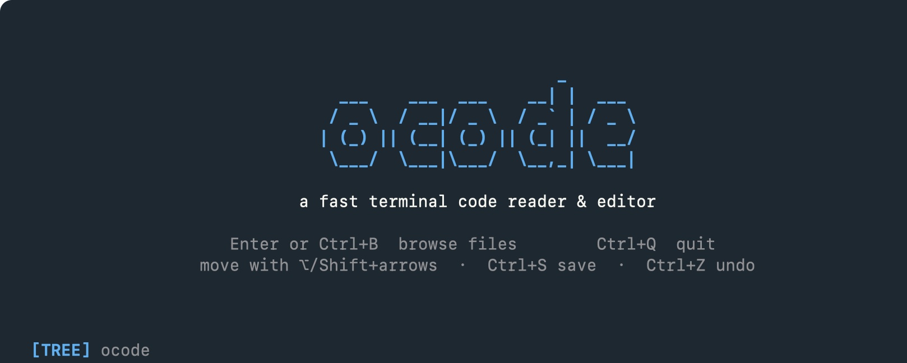
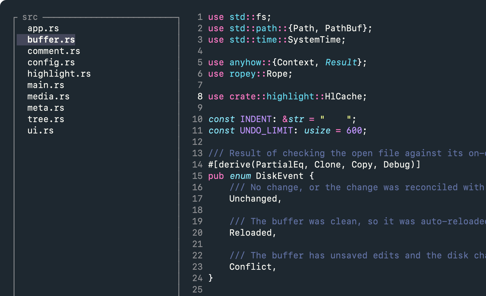
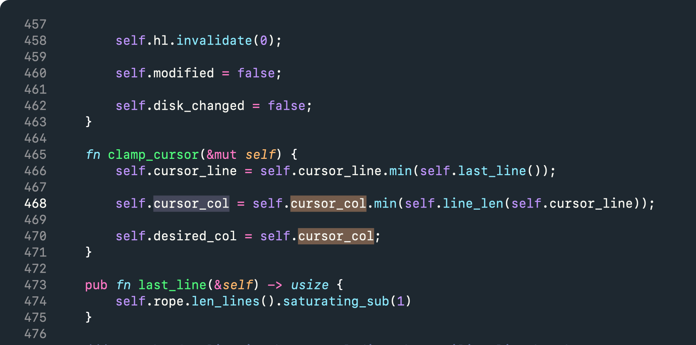
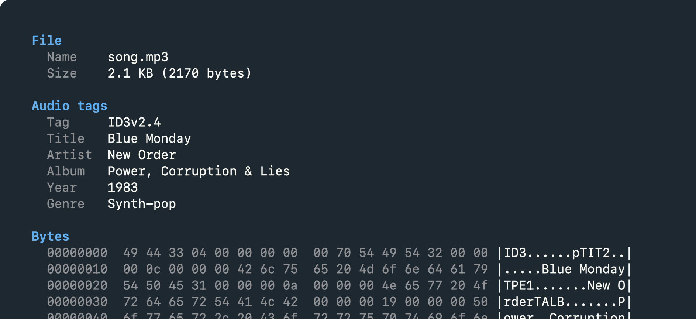

<h1 align="center">ocode</h1>

<p align="center">
  <b><code>ocode</code></b> · read and edit code in your terminal, fast.
</p>

<p align="center">
  
</p>

Point it at a file or a folder and it opens instantly: syntax-highlighted code,
a file tree, mouse and keyboard, a real system clipboard. The whole screen is
your code. The only chrome is one status line at the bottom, and even that is
drawn without a background so your terminal's own colours and transparency show
through.

## Install

```sh
brew install wstran/tap/ocode
```

Or build it yourself, which needs **Rust 1.85+** (pure-Rust dependencies, no C
compiler):

```sh
git clone https://github.com/wstran/ocode
cd ocode
cargo install --path .
```

## Usage

```sh
ocode               # browse the current directory
ocode src/main.rs   # open a file
ocode ./project     # open a directory (file tree)
ocode --style       # change the colour scheme
```

<p align="center">
  
</p>

## What it does

- **Fast on big files.** Rope buffer, incremental highlighting, and no polling
  loop: it sits at roughly 0% CPU when you are not typing.
- **Mouse and keyboard.** Click to place the caret, drag or `Shift`+click to
  select, wheel to scroll, click the tree to open files.
- **Real selection and clipboard.** Select, then `Ctrl+C`/`X`/`V` and paste into
  any other app.
- **Real undo/redo.** Word-granular, and it restores the selection with the
  text. "Unsaved" means the buffer actually differs from disk, not that you
  touched a key.
- **Watches the file.** A clean buffer auto-reloads when something else writes
  the file; with unsaved edits it warns instead of overwriting.
- **Images, binaries and metadata.** PNG/JPEG/GIF/BMP/WebP render inline in
  terminals that speak the kitty graphics protocol. Anything else opens as its
  metadata plus the whole file in hex, never an error.
- **15 themes, 119 languages** out of the box, and it only ever recolours your
  code, never the background.

## Keyboard

`Ctrl` is the command key, because a terminal never delivers `Cmd` to an
application. Hold `Shift` with any motion to select instead of move.

| Key | Action |
|-----|--------|
| `Ctrl+S` | Save |
| `Ctrl+A` | Select all |
| `Ctrl+C` / `Ctrl+X` / `Ctrl+V` | Copy / cut / paste |
| `Ctrl+Z` / `Ctrl+Y` | Undo / redo (`Ctrl+Shift+Z` also redoes) |
| `Ctrl+F` | Find |
| `Ctrl+B` | File tree: show, focus, hide |
| `Ctrl+R` | Reload from disk |
| `Ctrl+Q` | Quit |
| `Esc` | Step back one layer: clear the selection, else hide the tree, else open it to pick another file. Again with nothing left to do quits |

**Move** (add `Shift` to select)

| Move by | macOS | Windows / Linux |
|---------|-------|-----------------|
| Character | `←` `→` | `←` `→` |
| Word | `⌥ ←/→` | `Ctrl ←/→` |
| Line | `↑` `↓` | `↑` `↓` |
| Block (to the next blank line) | `⌥ ↑/↓` | `Ctrl ↑/↓` |
| Line start / end | `Fn ←/→` | `Home` `End` |
| File top / bottom | `Ctrl Home` `Ctrl End` | `Ctrl Home` `Ctrl End` |
| One screen | `Fn ↑/↓` | `PageUp` `PageDown` |

**Edit**

| Key | Action |
|-----|--------|
| any character, or paste | Insert, replacing the selection if there is one |
| `Enter` | New line, keeping the current indent |
| `Backspace` / `Delete` | Delete left / right, or the selection |
| `⌥ Delete` · `Ctrl Backspace` | Delete the word behind |
| `⌥ Fn Delete` · `Ctrl Delete` | Delete the word ahead |
| `Ctrl+K` | Delete the whole line |
| `Ctrl+/` | Comment or uncomment the line, or every line the selection covers |
| `Tab` / `Shift+Tab` | Indent / outdent, the line or the whole selection |

`Tab` and `Ctrl+/` both work on a multi-line selection, keep the selection
afterwards so you can press again, and undo in one step.

## Mouse

| Action | Effect |
|--------|--------|
| Click | Place the caret |
| Drag | Select |
| `Shift`+click | Extend the selection from the caret to the click |
| Wheel | Scroll the view, leaving the caret and any selection alone |
| Wheel in a binary or metadata view | Scroll the inspector |
| Click a file in the tree | First click selects it, a second click opens it |
| Click a folder in the tree | Expand or collapse, on the first click |

Opening a file with the mouse keeps the tree open, so you can keep browsing.
Opening it with `Enter` gives the editor the full screen. A file needs the
second click because opening one is disruptive and a stray click should not do
it; a folder does not, because expanding is cheap and reversible.

`ocode` asks the terminal for shift+click while it runs and hands it back on
exit, so your terminal's own shift-selection is untouched everywhere else.

## Find

<p align="center">
  
</p>

`Ctrl+F` starts with whatever you had selected as the query. Every occurrence is
tinted while the bar is open, `Enter` jumps to the next one and selects it, so
the current match stands out from the rest and `Ctrl+C` copies exactly what was
found. `Esc` closes the bar and keeps the selection.

## File tree

Open it with `Enter` from the welcome screen, or `Ctrl+B` from anywhere.
`↑`/`↓` move, `→`/`←` expand and collapse, `Enter` or `Space` opens, `Tab`
returns to the editor. It re-reads the folder as files appear and disappear.

## Styles

A scheme recolours your **code**; your terminal background is never painted
over. **15 are built in** (`base16-*`, Solarized, Dracula, One Dark, and more).
Drop a `.tmTheme` into `~/.config/ocode/themes/` for others. Your pick is saved
the first time you launch, and `ocode --style` reopens the picker.

The chrome follows the theme too: gutter, tree, selection and status text are
all derived from the active scheme, so switching themes recolours the whole
interface, not just the code.

## Languages

**119 languages** out of the box:

- **TypeScript** (`.ts/.mts/.cts`). `.tsx` and `.jsx` get a JSX-aware grammar
  that highlights elements, attributes and embedded expressions. `.mjs/.cjs`
  open as JavaScript.
- **Schemas, config, infra**: Protocol Buffers, GraphQL, TOML, `.env`, INI,
  Dockerfile, HCL/Terraform, Nix, Bicep.
- **Web3 and ZK**: Solidity, Vyper, Yul, Huff, Move, Cairo, Noir, Circom,
  ZoKrates, Sway, Cadence, Leo, Lean, plus Tact and FunC (TON), Clarity
  (Stacks), Aiken (Cardano), LIGO (Tezos), Pact (Kadena), TEAL (Algorand),
  Scilla.
- **Mobile and desktop**: Swift, Kotlin (`.kt/.kts`), Dart, F#, PowerShell.
- **HDL, asm, wasm**: Verilog/SystemVerilog, VHDL, Assembly (NASM and AT&T),
  WebAssembly text (`.wat/.wast`).
- **Modern systems**: Zig, Elixir, Julia.
- **Web supersets**, mapped to their base grammar: `.vue/.svelte/.astro` as
  HTML, `.scss/.sass/.less` as CSS, `.mdx` as Markdown.

Fenced code blocks in Markdown are highlighted as the language they name, so
a ```` ```rust ```` block in a README reads as Rust. syntect's own Markdown
grammar leaves those blocks plain, so ocode switches grammars at the fence
itself.

Add any `.sublime-syntax` grammar in `~/.config/ocode/syntaxes/`.

## Images, binaries and metadata

Open a PNG, JPEG, GIF, BMP or WebP and it is drawn inline, scaled to fit and
centred, through the kitty graphics protocol (Ghostty, Kitty). It stays visible
next to the file tree, so you can click through a folder of images.

<p align="center">
  
</p>

Press **`i`** on an image to see what the file says about itself instead of the
picture. Any other binary opens straight into that view: what the format is,
then the **whole file in hex**, scrolled with `↑`/`↓`, `PageUp`/`PageDown`,
`Home`/`End` and the wheel. Only the visible rows are read, so a multi-gigabyte
file opens as fast as a small one.

What gets read, all parsed in-tree with no extra dependency:

| Format | Reported |
|--------|----------|
| PNG | dimensions, bit depth, colour type, interlace, DPI, gamma, palette, transparency, ICC or sRGB, APNG frames, text chunks, and EXIF when present |
| JPEG | dimensions, precision, components, encoding, density, comment, XMP and ICC presence, Adobe transform, and **EXIF**: camera, lens, shutter, aperture, ISO, focal length, orientation, dates, **GPS** |
| GIF | version, dimensions, colour table, frame count, looping |
| BMP / WebP | dimensions, bit depth, compression, encoding, alpha and animation flags |
| MP4 / MOV | duration, dimensions, codecs, track count, creation time, brand, and the tags a camera writes: **location**, make, model, software, title, recording date |
| PDF | version, page count, title, author, subject, keywords, producer, creator, dates, linearised, encrypted |
| ZIP / gzip | entries, directory size, comment, original name, timestamp, originating system |
| ELF | class, byte order, type, machine, entry point, segments, sections, interpreter |
| Mach-O | class, architecture, type, load commands, UUID, minimum OS |
| WebAssembly | version, sections, import and export counts |
| MP3 | ID3 title, artist, album artist, album, year, genre, track, composer, publisher, comment, encoder, plus bit rate, sample rate and channel mode from the audio itself |
| FLAC | sample rate, channels, bit depth, duration, and the Vorbis comment tags |
| TrueType / OpenType | family, style, version, tables, units per em, glyph count |
| SQLite | page size, page count, writer version, text encoding, table count |

The location fields are the reason this exists. Photos routinely carry the
coordinates where they were taken, and so do videos from a phone, which is
worth seeing before you send one on. Timestamps that are stored as an instant
are labelled UTC, because a file written at 21:22 in Hanoi holds 14:22 and
reads as wrong otherwise; EXIF dates are left as they are, since the format
defines them as local camera time with no zone.

Reading never writes, so nothing here can strip a file's metadata the way some
viewers do when they re-save. Every parser walks untrusted bytes with checked
reads and bounded loops: a truncated or deliberately malformed file shows fewer
fields, and there is a test that walks every reader over damaged input to keep
it that way.

## Changes on disk

`ocode` watches the open file. If another program writes it, a **clean** buffer
reloads by itself and the reload is undoable. With **unsaved edits** it refuses
to clobber your work: the status bar warns, `Ctrl+R` takes the version on disk,
and a second `Ctrl+S` keeps yours.

## Terminal setup (macOS)

For word motion (`⌥ ←/→`) and word delete, turn on your terminal's meta key,
otherwise `⌥`+key just types an accented character:

- **Ghostty, Kitty, WezTerm**: works out of the box
- **iTerm2**: Settings, Profiles, Keys, Presets, **Natural Text Editing**
- **Terminal.app**: Settings, Profiles, Keyboard, **Use Option as Meta key**

Inline images need a terminal that speaks the **kitty graphics protocol**
(Ghostty, Kitty).

## Config

Everything lives in `~/.config/ocode/`: the saved theme in `config`, extra
themes in `themes/`, extra grammars in `syntaxes/`. The pre-rename location
`~/.config/opencode/` is still read, so an existing install keeps its settings.

## License

[MIT](LICENSE). Bundled themes and grammars are MIT by their authors, see the
`NOTICE` files. Built with [ratatui](https://github.com/ratatui/ratatui),
[crossterm](https://github.com/crossterm-rs/crossterm),
[ropey](https://github.com/cessen/ropey),
[syntect](https://github.com/trishume/syntect),
[arboard](https://github.com/1Password/arboard) and
[image](https://github.com/image-rs/image).
